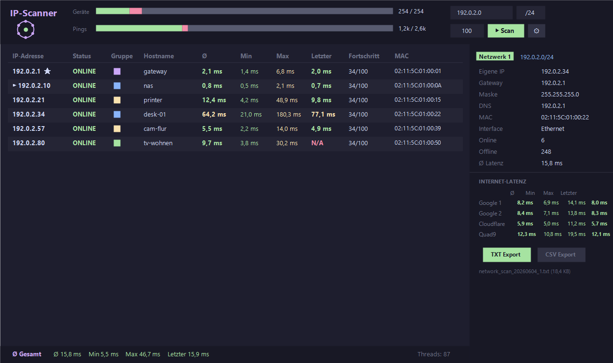

# IP-Scanner

Windows desktop network scanner. Pings every host in one or more IPv4 subnets,
resolves hostnames and MAC addresses, and shows live latency statistics in a
dark, table-focused UI. Built with C# / WPF on .NET 8, ships as a single
self-contained exe.



## Features

- Two-phase scan: fast discovery sweep, then a configurable number of analysis
  pings per device — devices join the run the moment they answer
- Known devices appear instantly at scan start with their stored hostname and
  MAC; live results replace the stored values during the run
- Devices that just dropped offline get a quick ping burst, so short dropouts
  recover within seconds; offline IPs keep being rechecked during the run
- Hostname/MAC resolution over several techniques in parallel (ARP, reverse
  DNS, mDNS, NetBIOS); the first result shows immediately, better ones replace it
- Latency table with min/avg/max/last, heatmap colors, best/worst markers and
  a totals row; edit hostnames and group colors right in the table
- Latency history graphs for any device or the network average, plus an
  internet latency panel with its own totals and graph
- Pin IPs from the table or the settings — pinned entries carry an optional
  name and color that show up everywhere
- Subnets, pinned IPs and internet hosts managed as colored bubbles in the
  settings
- Device grouping by MAC vendor and hostname prefix, gateway highlighted
- Known-devices database (SQLite), mergeable between instances, upgraded
  automatically after app updates
- TXT/CSV reports, toggled right in the sidebar with file name and size shown
- German/English UI — switches instantly, no restart; adjustable text size
- Settings save instantly, persist as a .conf you can relocate, export and
  import

Release history: see [CHANGELOG.md](CHANGELOG.md).

## Build

Requires the .NET 8 SDK on Windows.

```
build.bat
```

produces `dist\IP-Scanner.exe` (self-contained, no .NET install needed).

For development:

```
dotnet build IP-Scanner.slnx
dotnet test IP-Scanner.slnx
```

## Notes

Scan reports, the device database and the local configuration contain
information about your network. They are written to the scans folder and are
excluded from version control.
